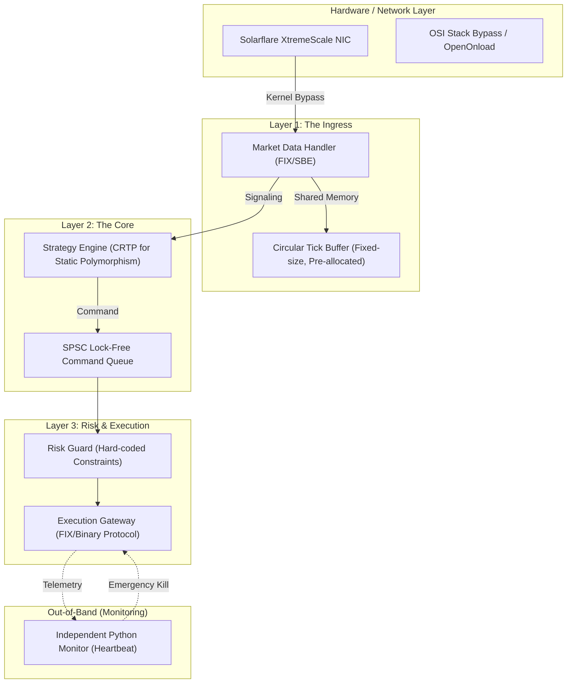

In the high-stakes world of high-frequency trading (HFT) and ultra-low latency execution, speed is not a feature—it is the fundamental unit of measure. In modern electronic markets like NASDAQ or the CME, the "Race to Zero" has reached a point where the time it takes for light to travel across a data center floor (roughly 1 nanosecond per foot) is a significant architectural constraint.

As markets become more efficient, **Alpha Decay** accelerates. A profitable signal discovered by a quantitative model might only remain profitable for a few hundred microseconds before the rest of the market reacts and the price "shrugs" in that direction. If your execution engine takes 1 millisecond to process a signal, you are likely trading against the informed flow of faster participants.

Development of **Plutus**, a high-performance C++ trading system used for NASDAQ futures, presented a unique challenge: achieving deterministic sub-millisecond execution while maintaining a complex statistical risk profile. This article explores the "Software as Hardware" philosophy required to build such a system.

---

## 1. The Physics of Latency: Why Nanoseconds Matter

To build a system that responds in microseconds, one must first respect the "Physics of Latency." Modern CPUs operate at 3-5 GHz, meaning a single clock cycle is roughly 0.2-0.3 nanoseconds. At this scale, every instruction, every branch, and every memory access is a potential bottleneck.

### The Memory Hierarchy Bottleneck
The biggest lie in modern programming is that memory access is "fast." In reality, the CPU's processing power has far outpaced memory latency—a phenomenon known as the "Memory Wall."
-   **L1 Cache Access**: ~1-2ns (3-4 cycles)
-   **L2 Cache Access**: ~3-5ns (10-12 cycles)
-   **L3 Cache Access**: ~10-20ns (30-50 cycles)
-   **Main Memory (RAM)**: ~60-100ns (Hundreds of cycles)
-   **TLB Miss**: ~10-50ns

In Plutus, a single L3 cache miss is enough to lose a trade. We minimize these misses by using **Data-Oriented Design (DOD)**. This means moving away from "Object-Oriented" hierarchies where data is scattered across the heap, and moving toward contiguous memory layouts. By ensuring that the data required by the hot path is laid out sequentially, we maximize the efficiency of the CPU's hardware pre-fetcher.

### Hardware Sympathy: Branch Prediction & Pre-fetching
Modern CPUs are masterpiece of speculation. They use sophisticated branch predictors to guess which way an `if/else` statement will go. A "Misprediction" causes the entire instruction pipeline to be flushed, costing 15-20 cycles.

In Plutus, we use **branchless programming** techniques (like using bitwise operations to replace logic) and the `[[likely]]` / `[[unlikely]]` attributes from C++20 to guide the compiler.

```cpp
// Strategy decision path with manual branch hinting
if (__builtin_expect(risk_engine.is_saturated(), 0)) [[unlikely]] {
    return Order::None();
}
```

---

## 2. Plutus Architecture: The Execution Pipeline

The Plutus system is designed as a unidirectional, event-driven pipeline. It is built to be "Single-Threaded" in its hot path to avoid the massive overhead of thread synchronization and cache coherency traffic.

### The Hot-Path Isolation
We use **Thread Pinning** (via `pthread_setaffinity_np`) to ensuring our "Hot Path" threads stay on isolated CPU cores. This prevents the OS scheduler from moving the thread, which would result in a "Context Switch"—the silent killer that flushes the L1 cache.



---

## 3. The Linux Kernel: Friend or Foe?

A standard Linux distribution is a disaster for low-latency code. The kernel is designed for "Fairness" and "Throughput"—it will happily "pause" your high-priority trading thread to manage memory pages or handle a periodic timer interrupt.

### Core Isolation and Kernel Tuning
We use several kernel-shaving techniques to achieve **determinism** (minimizing "Jitter"):
1.  **`isolcpus`**: A GRUB boot parameter that tells the Linux scheduler to never place any processes on specific cores.
2.  **`nohz_full`**: Disables the "tick" interrupt on isolated cores, allowing the CPU to stay in userspace for seconds at a time without kernel interruption.
3.  **`rcu_nocbs`**: Moves RCU (Read-Copy-Update) callback processing off the hot cores.
4.  **IRQ Affinity**: We manually route NIC interrupts to cores that are NOT running the trading engine.

When these are correctly configured, our core loop runs with **zero** context switches per second.

---

## 4. Networking: Bypassing the OSI Stack

The standard Linux TCP/IP stack involves context switches, interrupt processing, and multiple memory copies (from NIC to Kernel, then Kernel to User-space). For Plutus, we bypass this entirely using **Kernel Bypass** (Solarflare's OpenOnload).

### Zero-Copy Ingress
With kernel bypass, the NIC's transmit and receive rings are mapped directly into our application’s address space. When a packet arrives from the exchange (e.g., a "New Tick" from NASDAQ), our application sees the raw bytes in memory immediately. 
-   **Standard Stack**: ~15-50 microseconds "Wire-to-App"
-   **Kernel Bypass**: ~1-3 microseconds "Wire-to-App"

By utilizing **Busy Polling**, our ingress thread never "sleeps." It sits in a `while(true)` loop, checking the memory-mapped NIC descriptors thousands of times per second. This eliminates the latency of waiting for a hardware interrupt.

---

## 5. Advanced C++ Optimization Techniques

Plutus is written in modern C++20. We treat the language not as a high-level abstraction, but as a "Macro Assembler."

### Static Polymorphism (CRTP)
Virtual functions (`vtable` lookups) are unacceptable. They require an indirect jump (which the CPU cannot predict well) and they prevent the compiler from inlining the code. We use the **Curiously Recurring Template Pattern (CRTP)** to achieve polymorphism at compile-time.

```cpp
template<typename Derived>
class Strategy {
public:
    void on_tick(const Tick& tick) {
        // Static dispatch - zero cost
        static_cast<Derived*>(this)->process_impl(tick);
    }
};

class MeanReversion : public Strategy<MeanReversion> {
public:
    void process_impl(const Tick& tick) {
        // High-speed alpha logic
    }
};
```

### The Zero-Allocation Philosophy
We treat `new` and `delete` as fatal errors in our hot path. Dynamic memory allocation is non-deterministic and can trigger "Stop-the-World" events in the OS memory manager (e.g., page faults).
-   **Pre-allocation**: Every object—from tick buffers to order requests—is pre-allocated in a custom memory pool during the "Pre-Trading" phase.
-   **Alignment**: We use `alignas(64)` to ensure data structures align with CPU cache lines, preventing "False Sharing" where two threads fight over different parts of the same cache line.

---

## 6. Lock-Free Concurrency: The SPSC Queue

When passing data between threads (e.g., from Market Data to the Strategy Engine), we cannot use `std::mutex`. A mutex can put a thread to sleep, which destroys latency. Instead, we use **Lock-Free Single Producer Single Consumer (SPSC) Queues**.

These queues rely on **C++ Memory Barriers** (`std::memory_order_release` and `std::memory_order_acquire`) to ensure that data written by one thread is visible to another without the overhead of a lock.

```cpp
template <typename T, size_t Size>
class SPSCQueue {
    // Prevent False Sharing by padding the indices to different cache lines
    alignas(64) std::atomic<size_t> m_write_index{0};
    alignas(64) std::atomic<size_t> m_read_index{0};
    T m_buffer[Size];

public:
    bool push(const T& item) {
        const size_t current_write = m_write_index.load(std::memory_order_relaxed);
        const size_t next_write = (current_write + 1) % Size;
        if (next_write == m_read_index.load(std::memory_order_acquire)) {
            return false; // Queue full
        }
        m_buffer[current_write] = item;
        m_write_index.store(next_write, std::memory_order_release);
        return true;
    }

    bool pop(T& item) {
        const size_t current_read = m_read_index.load(std::memory_order_relaxed);
        if (current_read == m_write_index.load(std::memory_order_acquire)) {
            return false; // Queue empty
        }
        item = m_buffer[current_read];
        m_read_index.store((current_read + 1) % Size, std::memory_order_release);
        return true;
    }
};
```

---

## 7. Time Synchronization: PTP and Hardware Timestamps

When you are measuring latency in microseconds, the standard `gettimeofday()` is useless. We need nanosecond precision across multiple servers.

### Precision Time Protocol (PTP / IEEE 1588)
In Plutus, we use **PTP** instead of NTP. PTP allows us to synchronize our server's clock with the exchange's master clock with sub-microsecond accuracy. 

### Hardware Timestamping
Even with PTP, reading the clock via a syscall introduced jitter. We utilized the **Hardware Timestamping** feature of our Solarflare NICs. When a packet enters the NIC, the hardware attaches a 64-bit nanosecond timestamp to the packet buffer before our software even knows it arrived. This gives us the "Absolute Zero" time for our latency measurements.

---

## 8. Scaling: The Normalizer Pattern

As Plutus grew from NASDAQ to CME and Binance, we faced **Protocol Fragmentation**. Every exchange uses a different language (FIX 4.2, FIX 4.4, binary SBE, or JSON/WebSockets).

We implemented the **Normalizer Pattern**:
1.  Each exchange has a dedicated, pinned thread running a "Gateway."
2.  The Gateway translates exchange-specific bytes into a high-performance **Internal Canonical Format** (a packed C++ struct).
3.  The Strategy Engine only ever sees the Canonical format, allowing its code to remain "Alpha-Pure" and exchange-agnostic.

---

## 9. A Day in the Life of a Packet: The Trace

Let's trace a market tick through Plutus:
1.  **T+0μs**: NIC receives an Ethernet frame from NASDAQ. Hardware timestamping triggers.
2.  **T+1.2μs**: Application Ingress (Busy Polling) reads the raw bytes via Kernel Bypass (Zero Copy).
3.  **T+3.5μs**: Normalizer parses the FIX/SBE message into our Internal Canonical Format.
4.  **T+4.1μs**: Strategy Engine (pinned to Core 3) pops the tick from the SPSC queue.
5.  **T+8.2μs**: Branchless alpha logic updates the model state. Signal generated.
6.  **T+12.5μs**: Risk Guard performs "Pre-trade risk" checks (Position limit, Price sanity).
7.  **T+15.3μs**: Execution Gateway serializes the FIX "New Order Single" and pushes it out the wire.

Total "Wire-to-Wire" internal latency: **15.3 microseconds**.

---

## 10. Software-Defined Risk: The Multi-Layer Defensive Guard

In low-latency trading, a bug is not just an error—it's a liability that can lose millions in seconds (e.g., the Knight Capital incident). We implemented a "Defense in Depth" strategy:

1.  **L1 Guard (The Hot Guard)**: Hard-coded C++ constraints inside the execution path. No branches, just arithmetic (e.g., `current_qty + order_qty <= MAX_QTY`).
2.  **L2 Guard (The Sentinel)**: A standalone Python process that reads the raw execution logs via Shared Memory. If it detects "Spamming" or unusual behavior, it sends an `Emergency Kill` signal to the exchange gateway.
3.  **Heartbeat Monitor**: If the market data connection or the gateway thread fails to update a "Heartbeat" timestamp for >10ms, the system automatically pulls all active orders.

---

## 11. Profiling & Jitter Analysis: The Tail Matters

To debug a system that runs in microseconds, standard debuggers (GDB) and profilers (Valgrind) are useless—they change the system's timing (The "Observer Effect"). 

Instead, we use:
-   **High-Resolution TSC**: Using the CPU's `RDTSC` instruction to measure the latency of individual code blocks with nanosecond precision.
-   **Perf & LTTng**: To measure hardware metrics like L1 cache misses and branch mispredictions.
-   **Latency Histograms**: We don't care about "Average Latency." We care about **Percentiles** (P99, P99.9, and the "Max Outlier"). In HFT, the average is for vanity; the tail is for survival.

---

## 12. Conclusion: Precision as a Competitive Advantage

Building a low-latency system in C++ is a humbling exercise in precision. It forces you to think about the hardware, the kernel, and the mathematical reality of the markets simultaneously. 

Plutus isn't just a trading bot; it's a testament to **Mechanical Sympathy**—the idea that you must understand how the hardware works to use it efficiently. When you minimize the mechanical noise of the system—the cache misses, the context switches, and the lock contention—the true signal of your strategy finally becomes clear.

In the world of high-frequency trading, you don't rise to the level of your goals; you fall to the level of your systems. Plutus was built to ensure that level is as high as modern engineering allows.

---

### Technical Stack
| Component | Technology |
|---|---|
| **Language** | Modern C++20 |
| **Compiler** | GCC / Clang with `-Ofast -march=native` |
| **Operating System** | Custom-tuned Debian (Real-time Kernel) |
| **Networking** | Solarflare XtremeScale / OpenOnload (Kernel Bypass) |
| **Concurrency** | SPSC Lock-free Queues / Atomic Memory Barriers |
| **Time Sync** | PTP (IEEE 1588) with Hardware Timestamping |
| **Protocols** | FIX 4.2 / 4.4, Nasdaq ITCH/OUCH, Binary SBE |


