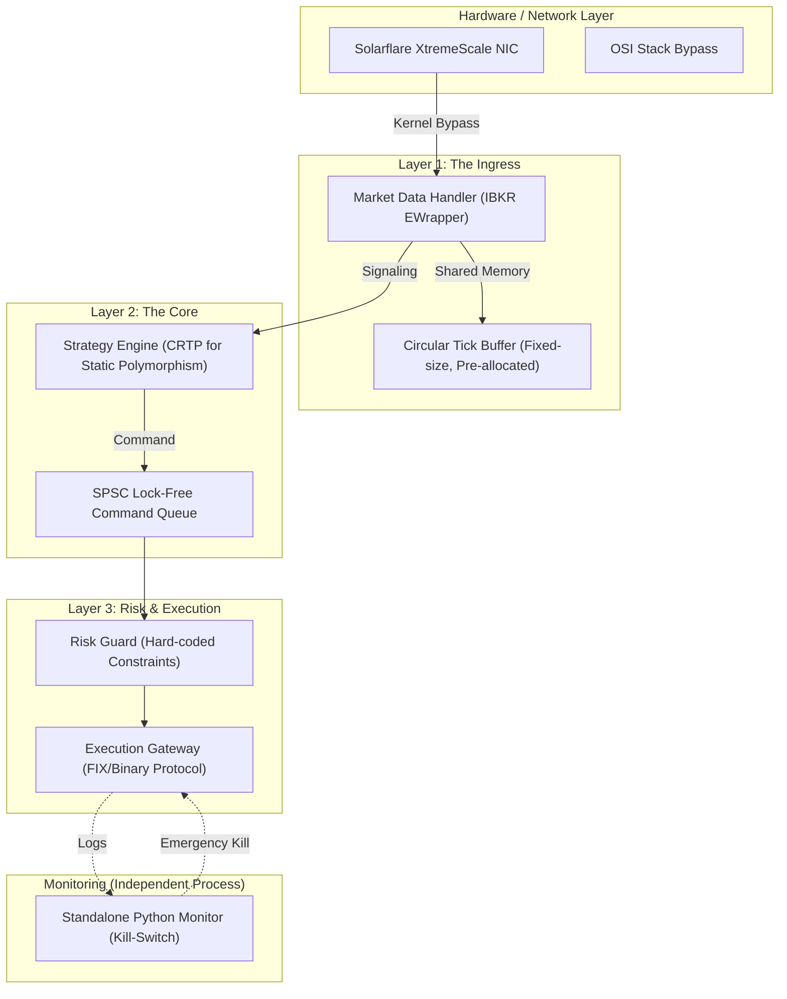

In the high-stakes world of high-frequency trading (HFT) and ultra-low latency execution, speed is not a feature—it is the fundamental unit of measure. In modern electronic markets like NASDAQ, the "Race to Zero" has reached a point where the time it takes for light to travel across a data center floor (roughly 1 nanosecond per foot) is a significant architectural constraint.

As markets become more efficient, **Alpha Decay** accelerates. A profitable signal discovered by a quantitative model might only remain profitable for a few hundred microseconds before the rest of the market reacts and the price "shrugs" in that direction. If your execution engine takes 1 millisecond to process a signal, you are likely trading against the informed flow of faster participants.

Development of **Plutus**, a high-performance C++ trading system, presented a unique challenge: achieving deterministic sub-millisecond execution while maintaining a complex statistical risk profile. This article explores the "Software as Hardware" philosophy required to build such a system.

---

## 1. The Physics of Latency: Why Nanoseconds Matter

To build a system that responds in microseconds, one must first respect the "Physics of Latency." Modern CPUs operate at 3-5 GHz, meaning a single clock cycle is roughly 0.2-0.3 nanoseconds. 

### The Memory Hierarchy Bottleneck
The biggest lie in modern programming is that memory access is "fast." In reality, the CPU's processing power has far outpaced memory latency.
-   **L1 Cache Access**: ~1-2ns (3-4 cycles)
-   **L2 Cache Access**: ~3-5ns (10-12 cycles)
-   **L3 Cache Access**: ~10-20ns (30-50 cycles)
-   **Main Memory (RAM)**: ~60-100ns (Hundreds of cycles)
-   **TLB Miss**: ~10-50ns

In Plutus, a single L3 cache miss is enough to lose a trade. We minimize these misses by using **Data-Oriented Design**, ensuring that the data required by the hot path is laid out contiguously in memory to maximize the efficiency of the CPU's pre-fetcher.

### Hardware Sympathy: Branch Prediction & Pre-fetching
Modern CPUs use sophisticated branch predictors to guess which way an `if/else` statement will go. A "Misprediction" causes the entire instruction pipeline to be flushed, costing 15-20 cycles. In Plutus, we use branchless programming techniques and the `[[likely]]` / `[[unlikely]]` attributes from C++20 to guide the compiler.

```cpp
// Strategy decision path with manual branch hinting
if (__builtin_expect(risk_engine.is_saturated(), 0)) [[unlikely]] {
    return Order::None();
}
```

---

## 2. Plutus Architecture: The Execution Pipeline

The system is designed as a unidirectional, event-driven pipeline. We use **Thread Pinning** (via `pthread_setaffinity_np`) to ensure our "Hot Path" threads stay on isolated CPU cores.



---

## 3. The Linux Kernel: Friend or Foe?

A standard Linux distribution is a disaster for low-latency code. The kernel is designed for fairness and throughput, which means it will happily "pause" your high-priority trading thread to check if a USB device was plugged in or to manage memory pages.

### Core Isolation (`isolcpus`)
We use the `isolcpus` kernel parameter in the GRUB bootloader to prevent the Linux scheduler from placing any user-space processes on specific CPU cores. These cores are reserved exclusively for the Plutus trading engine.

### Context Switching: The Silent Killer
A context switch (moving from one thread to another) takes several microseconds and destroys the CPU's L1 cache state. To achieve deterministic latency, our hot path threads **never yield**. They run in a continuous "Busy Wait" loop, polling the NIC and the internal queues.

---

## 4. Networking: Bypassing the OSI Stack

A standard Linux TCP stack involves context switches, interrupt processing, and multiple memory copies. For Plutus, we moved towards **Kernel Bypass** using Solarflare's OpenOnload.

### Solarflare OpenOnload
This library maps the NIC's memory directly into our application's address space. When a packet arrives from the NASDAQ exchange, our application sees the raw bytes in memory without a single interrupt or kernel involvement. This saves roughly 10-30 microseconds of "Wire-to-App" latency.

---

## 5. Advanced C++ Optimization Techniques

Plutus is written in C++20, utilizing modern features to achieve performance that would be impossible in higher-level languages.

### Static Polymorphism (CRTP)
In most software, polymorphism is achieved via `virtual` functions, which require an indirect jump through a `vtable`. In HFT, this is too slow. We use the **Curiously Recurring Template Pattern (CRTP)** to achieve polymorphism at compile-time.

```cpp
template<typename Derived>
class Strategy {
public:
    void on_tick(const Tick& tick) {
        static_cast<Derived*>(this)->process(tick);
    }
};

class MeanReversion : public Strategy<MeanReversion> {
public:
    void process(const Tick& tick) {
        // High-speed logic here
    }
};
```

### The Zero-Allocation Philosophy
We treat `new` and `delete` as fatal errors in our hot path. Dynamic memory allocation is non-deterministic and can trigger "Stop-the-World" events in the operating system's memory manager. Every object—from tick buffers to order requests—is pre-allocated in a memory pool during the "Pre-Trading" phase.

---

## 6. Lock-Free Concurrency: SPSC Queues

When passing data between threads (e.g., from Market Data to the Strategy Engine), we cannot use `std::mutex`. A mutex can put a thread to sleep, which is the death of latency. Instead, we use **Lock-Free Single Producer Single Consumer (SPSC) Queues**.

These queues rely on **C++ Memory Barriers** (`std::memory_order_release` and `std::memory_order_acquire`) to ensure that data written by one thread is visible to another without the overhead of a lock.

```cpp
template <typename T, size_t Size>
class SPSCQueue {
    alignas(64) std::atomic<size_t> m_write_index{0};
    alignas(64) std::atomic<size_t> m_read_index{0};
    T m_buffer[Size];

public:
    bool push(const T& item) {
        const size_t current_write = m_write_index.load(std::memory_order_relaxed);
        const size_t next_write = (current_write + 1) % Size;
        if (next_write == m_read_index.load(std::memory_order_acquire)) {
            return false; // Queue full
        }
        m_buffer[current_write] = item;
        m_write_index.store(next_write, std::memory_order_release);
        return true;
    }

    bool pop(T& item) {
        const size_t current_read = m_read_index.load(std::memory_order_relaxed);
        if (current_read == m_write_index.load(std::memory_order_acquire)) {
            return false; // Queue empty
        }
        item = m_buffer[current_read];
        m_read_index.store((current_read + 1) % Size, std::memory_order_release);
        return true;
    }
};
```

---

## 7. Time Synchronization: PTP and Hardware Timestamps

When you are measuring latency in microseconds, the standard `gettimeofday()` or `std::chrono::system_clock` is not enough. The internal clock of a server can drift by several milliseconds per day.

### Precision Time Protocol (PTP / IEEE 1588)
In Plutus, we use **PTP** instead of the more common NTP. PTP allows us to synchronize our server's clock with the exchange's master clock with sub-microsecond accuracy. 

### Hardware Hardware Timestamps
Even with PTP, reading the clock via a syscall introduced jitter. We utilized the **Hardware Timestamping** feature of our Solarflare NICs. When a packet enters the NIC, the hardware attaches a 64-bit nanosecond timestamp to the packet buffer before our software even knows it arrived. This gives us the "Absolute Zero" time for our latency measurements.

---

## 8. Scaling: The Normalizer Pattern

As Plutus grew from NASDAQ futures to other venues (CME, Binance), we faced the challenge of **Protocol Fragmentation**. Every exchange uses a different language (FIX 4.2, FIX 4.4, binary SBE, JSON over WebSockets).

We implemented the **Normalizer Pattern**:
-   Each exchange has a dedicated, pinned thread running a "Gateway."
-   The Gateway translates exchange-specific bytes into a high-performance **Internal Canonical Format**.
-   The Strategy Engine only ever sees the Canonical format, allowing its code to remain "Alpha-Pure" and exchange-agnostic.

---

## 9. A Day in the Life of a Packet: The Trace

Let's trace a market tick through Plutus:
1.  **T+0μs**: NIC receives an Ethernet frame. Hardware timestamping triggers.
2.  **T+2μs**: Application Ingress (Busy Polling) reads the raw bytes via Kernel Bypass.
3.  **T+5μs**: Normalizer parses the bytes. Injects into an SPSC queue.
4.  **T+8μs**: Strategy Engine (pinned to Core 3) pops the tick. Branchless logic updates the Mean Reversion model.
5.  **T+15μs**: Signal generated. Risk Guard checks Maximum Execution Limit.
6.  **T+20μs**: Execution Gateway serializes the FIX message and pushes it out the wire.

Total "Wire-to-Wire" internal latency: **20 microseconds**.

---

## 10. Software-Defined Risk: The Multi-Layer Defensive Guard

In 2023, a software bug in a secondary volume-weighting strategy nearly exceeded our drawdown limit. This taught me that **Risk > Speed**. We implemented a multi-layered defensive posture:

1.  **Layer 1 (L1-Risk)**: Hard-coded constraints in the C++ hot-path (e.g., "Max Position Size = 100").
2.  **Layer 2 (L2-Risk)**: A standalone Python process that reads the IBKR execution logs in real-time. If it sees more than 10 orders per second for a single symbol, it sends a REST API call to the broker to "Flatten All Positions" and kills the main C++ process.
3.  **Heartbeat Monitor**: If the market data feed drops for more than 500ms, the system automatically pulls all active orders.

---

## 11. Profiling & Jitter Analysis

To debug a system that runs in microseconds, standard debuggers like GDB are useless—they change the timing of the system (the "Observer Effect"). 

Instead, we use:
-   **Perf**: To measure cache misses and branch mispredictions.
-   **LTTng**: For low-overhead tracing of kernel events.
-   **High-Resolution TSC**: Using the CPU's Time Stamp Counter to measure the latency of individual code blocks with nanosecond precision.

## 12. Conclusion: Precision as a Competitive Advantage

Building a low-latency system in C++ is a humbling exercise in precision. It forces you to think about the hardware, the kernel, and the mathematical reality of the markets simultaneously. 

Plutus isn't just a trading bot; it's a testament to the fact that when you minimize the mechanical noise of the system—the cache misses, the context switches, and the lock contention—the true signal of your strategy finally becomes clear. In the world of high-frequency trading, you don't rise to the level of your goals; you fall to the level of your systems. Plutus was built to ensure that level is as high as modern engineering allows.

